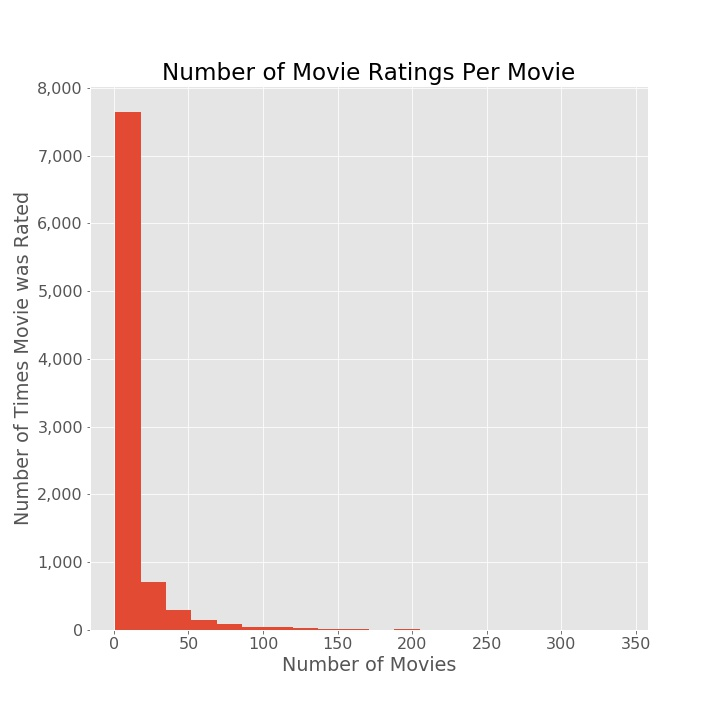
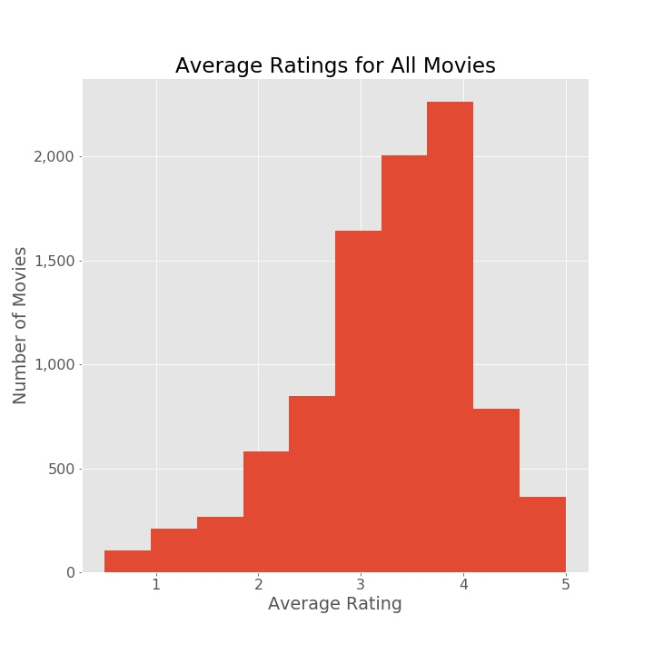
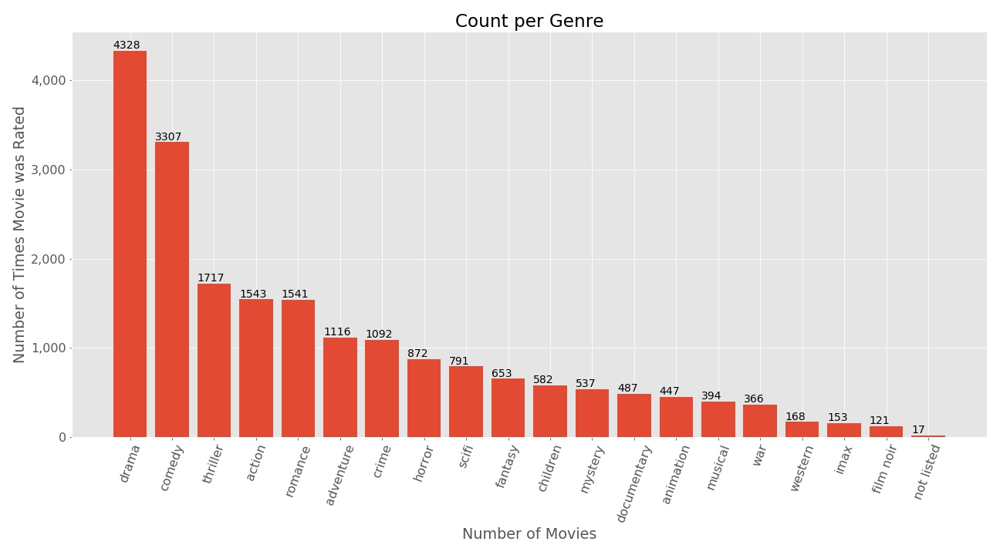
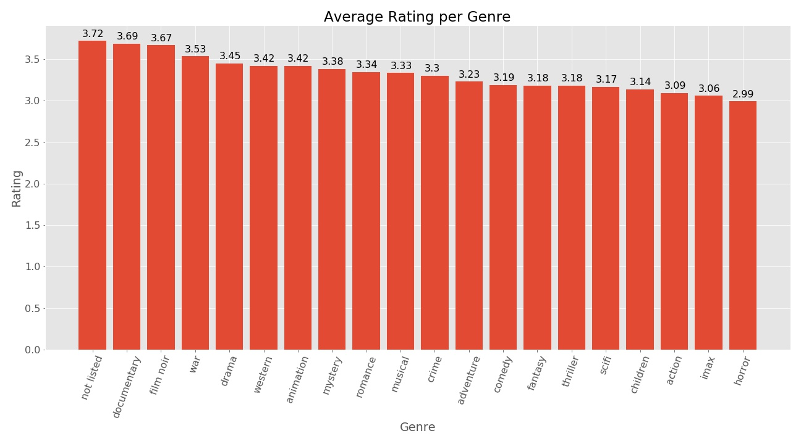
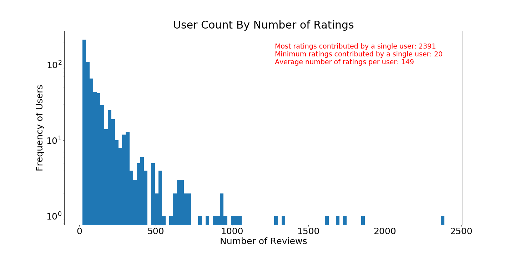
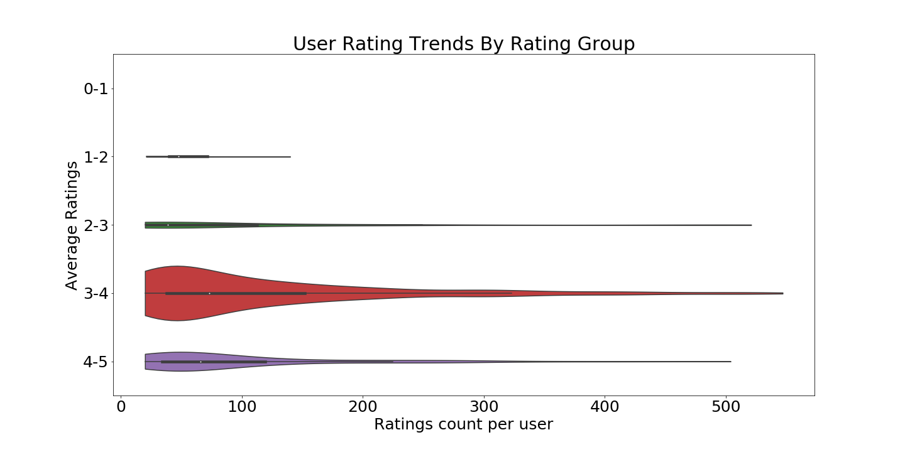
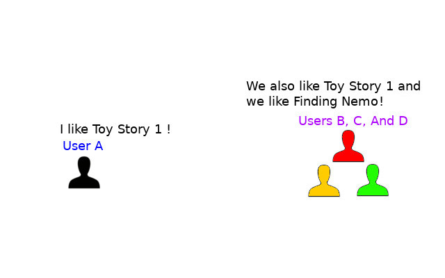
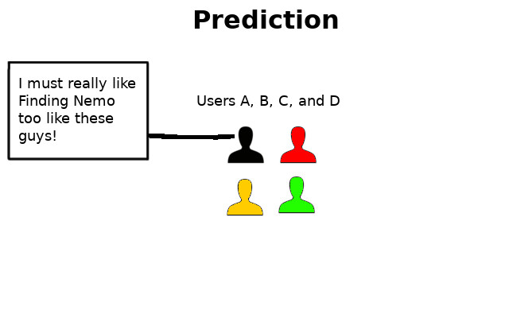
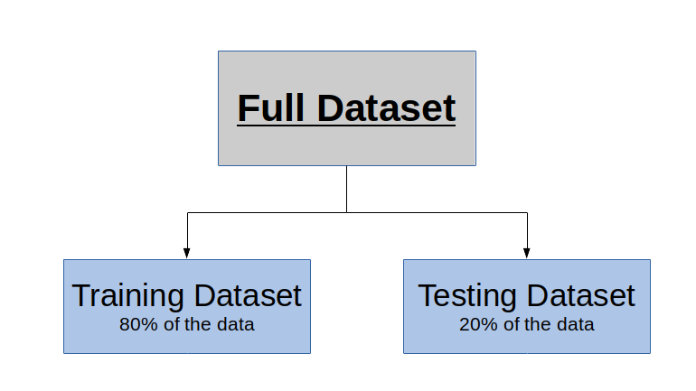

# **Movie Recommender Case Study for Movies-Legit** <!-- omit in toc -->

## Written and Prepared By:<!-- omit in toc -->  
### Thomas Duffy | Alex Cross | Emily Hueni | Timothy Miller<!-- omit in toc -->  

 

# **Table of Contents** <!-- omit in toc -->
- [**Introduction**](#introduction)
- [**Exploring Available Data**](#eda-and-finding-data)
  - [Movie Data](#movie-data)
  - [User Data](#user-data)
- [What Is Our Existing Model?](#what-is-our-als-model)
- [What Is Our Improved Model?](#what-is-our-als-model)

  - [Model Preparation](#model-preparation)

# **Introduction**
Our challenge was to create a recommender system which can more accurately predict how a viewer would rate a certain movie based on their rating history better than the existing model. We created a model using Python, Spark and the [Surprise](http://surpriselib.com/) library.

 
# **Exploring Available Data**
We dove into our existing movie ratings data to explore options for creating an improved model. We have ratings by users for movies as well as information about each movie. We come up with some metrics to represent the general state of our data.

## Movie Data
Some basic statistics are visualized below:

  

  

These two histograms represent, based on the movies, how many ratings there are per movie as well as the counts of the average rating per movie. Note that most of the movies have relatively few ratings, while only a few have over 10. The average rating for most movies is between 3 and 4, and very few movies have average ratings below 2 or over 5.

 

  

When we broke up our ratings data by genre, we found that **dramas** and **comedies** were rated **most frequently** within this dataset.

 

  

The **average movie rating per genre** was fairly consistently between 3 and 4, with the most highly rated genres being movies **without a genre label**, **documentaries**, and **film noir**.

## User Data
Most users have submitted only small numbers of reviews, but there are some outliers who have submitted thousands. The chart below shows this distribution on a log scale, which allows the outliers to be visible.

 

Most users have an average rating score between 3 and 4, with ~9% of users averaging below that, and 23% of users averaging above that. The graph below shows that most of the users who consistently rated movies very poorly (1-2) did not see as many movies. Although not as extreme, the same is true of users who consistently rated movies very highly.

 

  

# What Is Our Existing Model?
Our existing recommender model is called a **Mean of Means** model. It works based on the fact that some users like to rate things highly, while others simply do not. In addition, some movies have higher average ratings than others. The model simply predicts ratings based on these two factors.

# What Is Our Improved Model?
We are proposing a shift to an **Alternating Least Squares (ALS)** model. Before we go into details, we would like to explain how ALS models work.  This model provides predictions for a given user and a given movie based on how similar users have rated the movie in question. The model identifies similar users by comparing existing ratings for all users and movies.

For example: We would like to predict how User A might rate "Finding Nemo", and we know they rated "Toy Story 1" highly. We also know that Users B, C and D rated "Toy Story 1" highly, and they really liked "Finding Nemo". We can then predict that User A will like Finding Nemo.

  

  

## Model Development
In preparation for building and evaluating a new model, the full dataset was subdivided into two groups. The first was a training group that was used to train and test the new model, and the second was a testing group that was used to evaluate the model and provide a final accuracy score. This method gives us to predict accurately how well the new model will perform in production.

 

We also focused on using very **scalable architecture**, which will allow our improved recommender model to be deployed to the cloud and scaled up to meet the needs of our entire user base.

## Model Demo

For a given user, their top rated movies might be the following:

|Movie|Rating|
|---:|-----------:|
|Cast Away|5|
|Lord of the Rings: The Fellowship of the Ring, The (2001)|5|
|Lord of the Rings: The Return of the King, The (2003)|5|
|Unknown Soldier, The (Tuntematon sotilas) (1955)|4.5|
|Star Wars: Episode VI - Return of the Jedi (1983)|4.5|
|Good, the Bad and the Ugly, The (Buono, il brutto, il cattivo, Il) (1966)|4.5|
|Terminator 2: Judgment Day (1991)|4.5|

Based on these ratings, our model would recommend the following movies to this user:

|Movie|
|---:|
|Game Plan, The (2007)|
|Cops (1922)|
|Land of Silence and Darkness (Land des Schweigens und der Dunkelheit) (1971)|
|Vampyros Lesbos (Vampiras, Las) (1971)|
|Excision (2012)|
|Dylan Moran: Monster (2004)|
|Family Stone, The (2005)|
|Flicka (2006)|

# Results
When compared to the previous model, our new model shows an
## 18.3% IMPROVEMENT FOR RECOMMENDATIONS.
We also confirmed that our new model should not take significantly more resources to run than our existing model:

| Movielens(100k)	| RMSE | Time |
|---:|-----------:|----:|
|GlobalMean|1.126|0:00:01|
|MeanofMeans|	1.017	|	0:00:01|
|ALS_Surprise|	0.944|	0:00:01|
|ALS_Spark| 0.92| 0:00:03|

# Proposed Plan of Implementation
We suggest moving a a small percentage (5-10%) of our customer base over to the new model for a trial period (3-6 months). From there, we would like to analyze the retention rate for users on the new model versus the old model. We are confident that we will see an improvement in retention, as our new model will be suggesting more appropriate movies for each customer. Assuming success, we would like to start shifting a percentage of customers per month from the old model to the new model.